# 🧘‍♀️ Moodmend DB 프로젝트

감정 기반 명상 콘텐츠 추천 플랫폼 **Moodmend**의 데이터베이스 모델링 프로젝트입니다.

&nbsp;

<p align="center">
  
</p>

---

## 📌 프로젝트 개요  

**Moodmend**는 감정 상태에 따라 맞춤 명상 콘텐츠를 추천하고, 유저의 지속적인 참여를 유도하는 감정 기반 명상 플랫폼입니다.  
이번 프로젝트는 Moodmend의 서비스 흐름을 바탕으로 **실제 서비스 운영에 적합한 ERD(Entity Relationship Diagram)를 설계**하고,  
**SQL 쿼리와 프로시저가 요구사항대로 정확하게 실행되는지 테스트**하는 데 중점을 두었습니다.

---

## 📅 프로젝트 기간  

**2025.06.05 ~ 2025.06.09**

---

## 🎯 기획 의도 및 배경  

명상은 여전히 비주류로 인식되는 콘텐츠입니다.  
Moodmend는 다음과 같은 핵심 목표를 중심으로 설계되었습니다:

- 감정 일기 기반 맞춤 추천 시스템  
- 프리미엄 콘텐츠 유료 판매 시스템  
- 출석 및 포인트 보상 기반 참여 유도  
- 아바타, 커뮤니티, 가상 시장, 실명 기반 채팅 등 재미 요소 추가  

이러한 요소를 통해 **사용자 참여를 유도하고, 명상 콘텐츠의 접근성과 확산을 높이는 것**이 핵심 방향입니다.

---

## 🧩 기능 구조 및 테이블 분류  

| 도메인        | 관련 테이블 |
|---------------|-------------|
| 회원관리      | `members`, `friend` |
| 콘텐츠        | `contents`, `likes`, `downloads`, `emotion`, `owned`, `payment_detail`, `reports` |
| 구매          | `cart`, `payment`, `payment_detail`, `owned` |
| 주문          | `payment`, `payment_detail` |
| 플레이리스트  | `playlist`, `playlist_detail` |
| 재화          | `members`, `point_reward` |
| 보상          | `attendance`, `point_reward` |
| 아이템        | `items`, `owned`, `payment`, `payment_detail`, `cart` |
| 아바타        | `avatar`, `avatar_items_map`, `items`, `post` |
| 게시판        | `post`, `post_likes` |
| 감정 다이어리 | `emotion_diary`, `emotion` |
| 명상 클래스   | `meditation_class`, `class_reservation`, `class_feedback` |

---

## 🗂️ ERD 모델 요약  

> ✏️ 추후 입력 예정

---

## 📎 프로젝트 주요 산출물  

각 항목은 클릭하여 확인하거나 다운로드할 수 있습니다.

- ✅ [요구사항 정의서](https://docs.google.com/spreadsheets/d/1lFGjxB9mXCP0s3Rz3rKsKB5AYQrcu9vMIBpgAjZERnI/edit#gid=1298947418)  
- ✅ [WBS (Work Breakdown Structure)](https://docs.google.com/spreadsheets/d/1lFGjxB9mXCP0s3Rz3rKsKB5AYQrcu9vMIBpgAjZERnI/edit#gid=0)  
- ✅ [ERD 설계 이미지 보기](https://www.erdcloud.com/d/M7TAEEmzaw7qiSWE2)
<br>
<p align="center">
  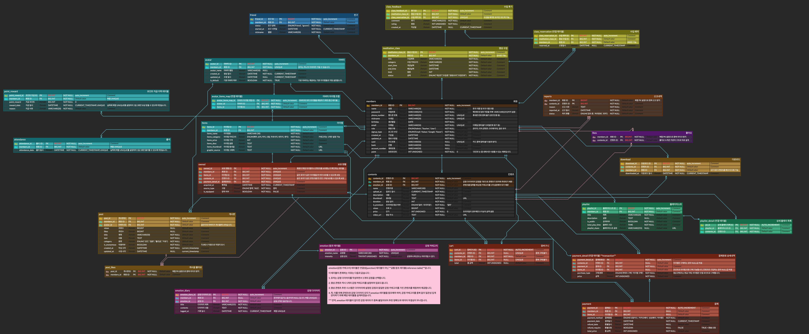
</p>

- ✅ [테스트용 DML 쿼리 파일 다운로드](#)
---
## 📄 프로시저 테스트 결과

<details>
<summary>▶️ 프로시저 테스트</summary>

### 01. 회원가입 프로시저
<p align="center">
  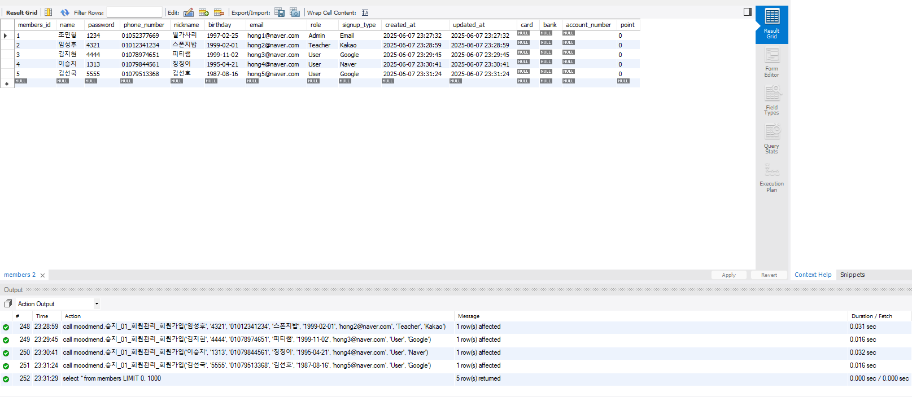
</p>

```sql
DELIMITER $$

CREATE PROCEDURE 회원가입 (
  IN p_name VARCHAR(20),
  IN p_password VARCHAR(255),
  IN p_phone_number VARCHAR(20),
  IN p_nickname VARCHAR(20),
  IN p_birthday DATE,
  IN p_email VARCHAR(50),
  IN p_role ENUM('Admin', 'Teacher', 'User'),
  IN p_signup_type ENUM('Email', 'Kakao', 'Google', 'Naver')
)
BEGIN
  IF EXISTS (
    SELECT 1 FROM members 
    WHERE phone_number = p_phone_number OR email = p_email
  ) THEN
    SIGNAL SQLSTATE '45000'
    SET MESSAGE_TEXT = '이미 등록된 이메일 또는 전화번호입니다.';
  ELSE
    INSERT INTO members (
      name, password, phone_number, nickname, birthday, email,
      role, signup_type, created_at, updated_at, point
    )
    VALUES (
      p_name, p_password, p_phone_number, p_nickname, p_birthday, p_email,
      p_role, p_signup_type, NOW(), NOW(), 0
    );
  END IF;
END$$

DELIMITER ;
```

### 02. 로그인 프로시저

<p align="center">
  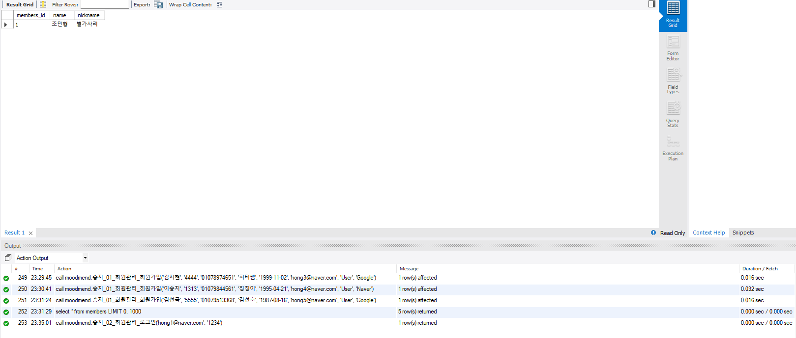
</p>

```sql
DELIMITER $$

CREATE PROCEDURE 로그인 (
  IN p_login_id VARCHAR(50), -- 이메일 또는 전화번호
  IN p_password VARCHAR(255)
)
BEGIN
  IF EXISTS (
    SELECT 1 FROM members 
    WHERE (email = p_login_id OR phone_number = p_login_id)
      AND password = p_password
  ) THEN
    SELECT members_id, name, nickname FROM members 
    WHERE (email = p_login_id OR phone_number = p_login_id)
      AND password = p_password;
  ELSE
    SIGNAL SQLSTATE '45000'
    SET MESSAGE_TEXT = '로그인 정보가 일치하지 않습니다.';
  END IF;
END$$

DELIMITER ;


```

### 03. 콘텐츠 등록 프로시저

<p align="center">
  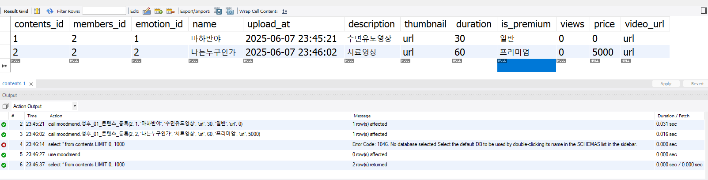
</p>

```sql
DELIMITER $$

CREATE PROCEDURE 콘텐츠_등록(
    IN p_members_id BIGINT,
    IN p_emotion_id BIGINT,
    IN p_name VARCHAR(100),
    IN p_description TEXT,
    IN p_thumbnail TEXT,
    IN p_duration INT,
    IN p_is_premium ENUM('일반', '프리미엄'),
    IN p_video_url TEXT,
    IN p_price INT UNSIGNED
)
BEGIN
    IF p_is_premium = '프리미엄' AND p_price = 0 THEN
        SIGNAL SQLSTATE '45000'
        SET MESSAGE_TEXT = '프리미엄 콘텐츠는 가격이 0원이 될 수 없습니다.';
    END IF;

    IF p_is_premium = '일반' AND p_price != 0 THEN
        SET p_price = 0;
    END IF;

    INSERT INTO contents (
        members_id,
        emotion_id,
        name,
        description,
        thumbnail,
        duration,
        is_premium,
        views,
        price,
        video_url
    ) VALUES (
        p_members_id,
        p_emotion_id,
        p_name,
        p_description,
        p_thumbnail,
        p_duration,
        p_is_premium,
        0,
        p_price,
        p_video_url
    );
END $$

DELIMITER ;

select * from contents;
```

### 04. 좋아요 등록 프로시저

<p align="center">
  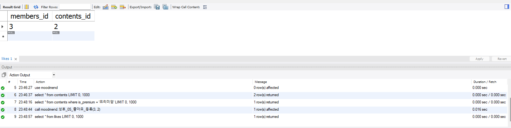
</p>

```sql
DELIMITER $$

CREATE PROCEDURE 좋아요_등록(
    IN p_members_id BIGINT,
    IN p_contents_id BIGINT
)
BEGIN
    DECLARE EXIT HANDLER FOR SQLEXCEPTION
    BEGIN
        ROLLBACK;
        SIGNAL SQLSTATE '45000'
        SET MESSAGE_TEXT = '좋아요 등록 중 오류 발생(롤백 수행됨)';
    END;

    START TRANSACTION;

    -- 중복 좋아요 방지: 트랜잭션 내에서도 확인
    IF EXISTS (
        SELECT 1 FROM likes
        WHERE members_id = p_members_id AND contents_id = p_contents_id
        FOR UPDATE
    ) THEN
        ROLLBACK;
        SIGNAL SQLSTATE '45000'
        SET MESSAGE_TEXT = '이미 좋아요를 누르셨습니다.';
    END IF;

    INSERT INTO likes (members_id, contents_id)
    VALUES (p_members_id, p_contents_id);

    COMMIT;
END $$

DELIMITER ;
```


### 05. 좋아요 취소 프로시저

<p align="center">
  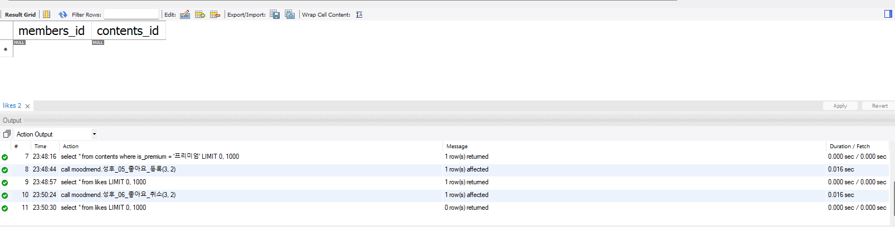
</p>

```sql
DELIMITER $$

CREATE PROCEDURE 좋아요_취소(
    IN p_members_id BIGINT,
    IN p_contents_id BIGINT
)
BEGIN
    DECLARE EXIT HANDLER FOR SQLEXCEPTION
    BEGIN
        ROLLBACK;
        SIGNAL SQLSTATE '45000'
        SET MESSAGE_TEXT = '좋아요 취소 중 오류 발생(롤백 수행됨)';
    END;

    START TRANSACTION;

    -- 좋아요 눌렀는지 확인 및 잠금
    IF NOT EXISTS (
        SELECT 1 FROM likes
        WHERE members_id = p_members_id AND contents_id = p_contents_id
        FOR UPDATE
    ) THEN
        ROLLBACK;
        SIGNAL SQLSTATE '45000'
        SET MESSAGE_TEXT = '좋아요를 누른 기록이 없습니다.';
    END IF;

    DELETE FROM likes
    WHERE members_id = p_members_id AND contents_id = p_contents_id;

    COMMIT;
END $$

DELIMITER ;
```

### 06. 특정 카테고리 콘텐츠 조회 프로시저

<p align="center">
  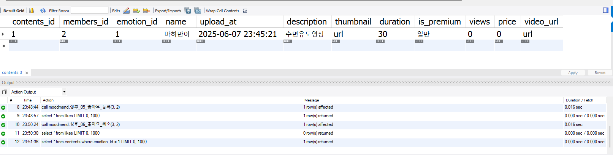
</p>

```sql
DELIMITER $$

CREATE PROCEDURE 카테고리별_콘텐츠_조회(
    IN p_category VARCHAR(20)
)
BEGIN
    SELECT 
        c.contents_id,
        c.name,
        c.description,
        c.thumbnail,
        c.duration,
        c.price,
        c.is_premium,
        c.upload_at,
        e.emotion_name,
        m.nickname AS creator
    FROM contents c
    JOIN emotion e ON c.emotion_id = e.emotion_id
    JOIN members m ON c.members_id = m.members_id
    WHERE e.emotion_name = p_category;
END $$

DELIMITER ;
```

### 07. 콘텐츠 신고 프로시저

<p align="center">
  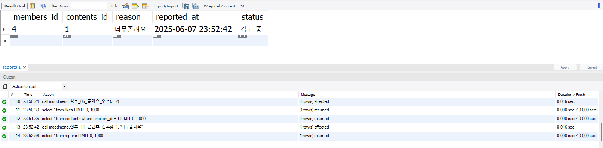
</p>

```sql
DELIMITER $$

CREATE PROCEDURE 콘텐츠_신고 (
    IN p_members_id BIGINT,
    IN p_contents_id BIGINT,
    IN p_reason TEXT
)
BEGIN
    IF EXISTS (
        SELECT 1 FROM reports
        WHERE members_id = p_members_id AND contents_id = p_contents_id
    ) THEN
        SIGNAL SQLSTATE '45000'
        SET MESSAGE_TEXT = '이미 신고한 콘텐츠입니다.';
    END IF;

    INSERT INTO reports (members_id, contents_id, reason, reported_at, status)
    VALUES (p_members_id, p_contents_id, p_reason, NOW(), '검토 중');
END $$

DELIMITER ;
```

### 08. 장바구니 추가 프로시저

<p align="center">
  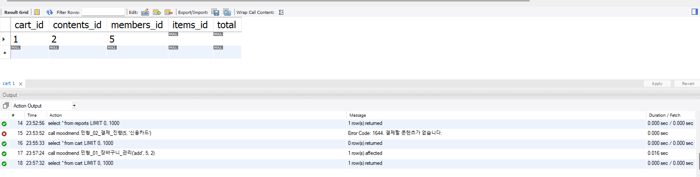
</p>

```sql
DELIMITER $$

CREATE PROCEDURE 장바구니_관리 (
    IN p_action VARCHAR(20),          -- 'add', 'remove', 'clear'
    IN p_members_id BIGINT,
    IN p_contents_id BIGINT
)
BEGIN
    DECLARE v_is_premium ENUM('일반', '프리미엄');
    DECLARE v_price INT UNSIGNED;

    IF p_action = 'add' THEN
        -- 프리미엄 여부 및 가격 확인
        SELECT is_premium, price INTO v_is_premium, v_price
        FROM contents
        WHERE contents_id = p_contents_id;

        IF v_is_premium != '프리미엄' THEN
            SIGNAL SQLSTATE '45000'
            SET MESSAGE_TEXT = '무료 콘텐츠는 장바구니에 담을 수 없습니다.';
        END IF;

        -- total 포함하여 장바구니에 추가
        INSERT IGNORE INTO cart (members_id, contents_id, total)
        VALUES (p_members_id, p_contents_id, v_price);

    ELSEIF p_action = 'remove' THEN
        DELETE FROM cart
        WHERE members_id = p_members_id AND contents_id = p_contents_id;

    ELSEIF p_action = 'clear' THEN
        DELETE FROM cart
        WHERE members_id = p_members_id;
    END IF;
END $$

DELIMITER ;
```

### 09. 콘텐츠 구매 프로시저

<p align="center">
  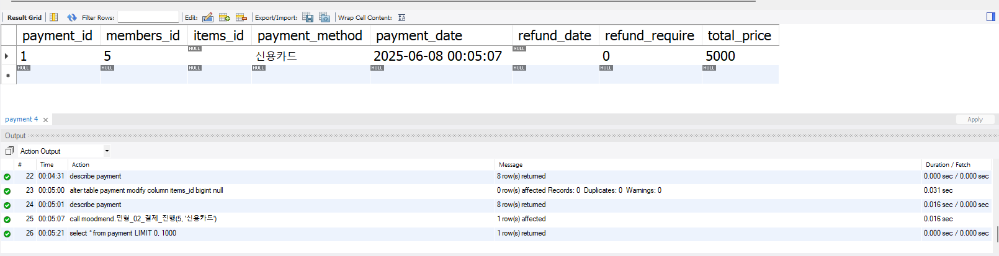
</p>

```sql
DELIMITER $$

CREATE PROCEDURE 콘텐츠 구매 (
    IN p_members_id BIGINT,
    IN p_payment_method ENUM('신용카드', '휴대폰', '계좌이체')
)
BEGIN
    DECLARE v_total INT UNSIGNED;
    DECLARE v_payment_id BIGINT;
    DECLARE v_cart_contents_id BIGINT;
    DECLARE v_cart_items_id BIGINT;

    -- [1] 유효한 결제 대상이 하나만 존재하는지 확인
    IF NOT EXISTS (
        SELECT 1 FROM cart
        WHERE members_id = p_members_id
          AND ((contents_id IS NOT NULL AND items_id IS NULL) OR (contents_id IS NULL AND items_id IS NOT NULL))
          AND total IS NOT NULL AND total > 0
    ) THEN
        SIGNAL SQLSTATE '45000'
        SET MESSAGE_TEXT = '결제할 항목이 없습니다.';
    END IF;

    -- [2] 유효한 데이터 1개를 가져옴 (정확한 조건 포함)
    SELECT contents_id, items_id, total
    INTO v_cart_contents_id, v_cart_items_id, v_total
    FROM cart
    WHERE members_id = p_members_id
      AND ((contents_id IS NOT NULL AND items_id IS NULL) OR (contents_id IS NULL AND items_id IS NOT NULL))
      AND total IS NOT NULL AND total > 0
    LIMIT 1;

    -- [3] payment 테이블 기록
    INSERT INTO payment (
        members_id, items_id, payment_method, total_price
    )
    VALUES (
        p_members_id, v_cart_items_id, p_payment_method, v_total
    );

    SET v_payment_id = LAST_INSERT_ID();

    -- [4] 콘텐츠 결제 처리
    IF v_cart_contents_id IS NOT NULL THEN
        INSERT INTO payment_detail (
            contents_id, payment_id, purchase_type, price
        )
        VALUES (
            v_cart_contents_id, v_payment_id, '콘텐츠 구매', v_total
        );

        INSERT INTO owned (
            members_id, contents_id, payment_detail_id, source_type
        )
        VALUES (
            p_members_id, v_cart_contents_id, LAST_INSERT_ID(), '결제'
        );
    END IF;

    -- [5] 아이템 결제 처리
    IF v_cart_items_id IS NOT NULL THEN
        INSERT INTO payment_detail (
            items_id, payment_id, purchase_type, price
        )
        VALUES (
            v_cart_items_id, v_payment_id, '아이템 구매', v_total
        );

        INSERT INTO owned (
            members_id, items_id, payment_detail_id, source_type
        )
        VALUES (
            p_members_id, v_cart_items_id, LAST_INSERT_ID(), '결제'
        );
    END IF;

    -- [6] 장바구니 비우기
    DELETE FROM cart 
    WHERE members_id = p_members_id;
END $$

DELIMITER ;
```

### 10. 상세구매내역 조회 프로시저

<p align="center">
  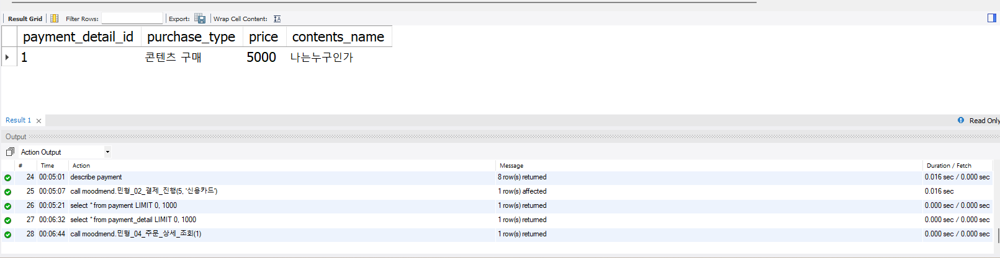
</p>

```sql
DELIMITER $$


DELIMITER ;
```

### 11. 플레이리스트 생성 프로시저

<p align="center">
  
</p>

```sql
DELIMITER $$


DELIMITER ;
```


### 12. 플레이리스트 등록 프로시저

<p align="center">
  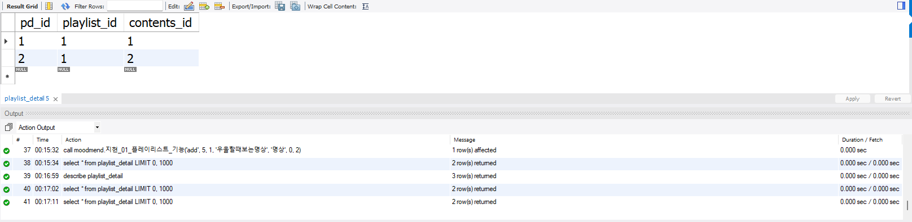
</p>

```sql
DELIMITER $$


DELIMITER ;
```

### 13. 신규유저 100포인트 지급 프로시저

<p align="center">
  
</p>

```sql
DELIMITER $$


DELIMITER ;
```

### 14. 포인트 지급내역 조회 프로시저

<p align="center">
  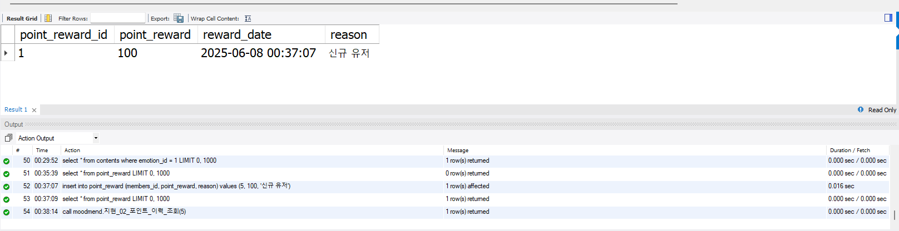
</p>

```sql
DELIMITER $$


DELIMITER ;
```

### 15. 아이템 등록 프로시저

<p align="center">
  
</p>

```sql
DELIMITER $$


DELIMITER ;
```

### 16. 아이템 구매 보유내역 조회 프로시저

<p align="center">
  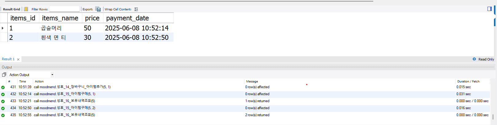
</p>

```sql
DELIMITER $$


DELIMITER ;
```


### 17. 아바타 등록 프로시저

<p align="center">
  
</p>

```sql
DELIMITER $$


DELIMITER ;
```

### 18. 게시판 등록, 게시판 조회 프로시저

<p align="center">
  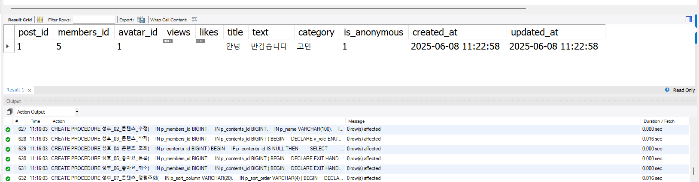
</p>

```sql
DELIMITER $$


DELIMITER ;
```


### 19. 감정 다이어리 기록, 감정 다이어리 조회 프로시저

<p align="center">
  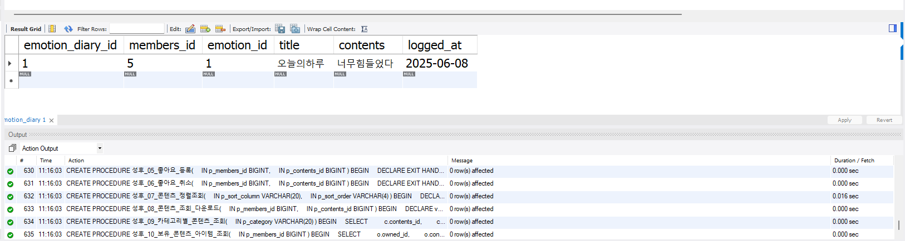
</p>

```sql
DELIMITER $$


DELIMITER ;
```

### 20. 감정 기반 콘텐츠 추천 프로시저

<p align="center">
  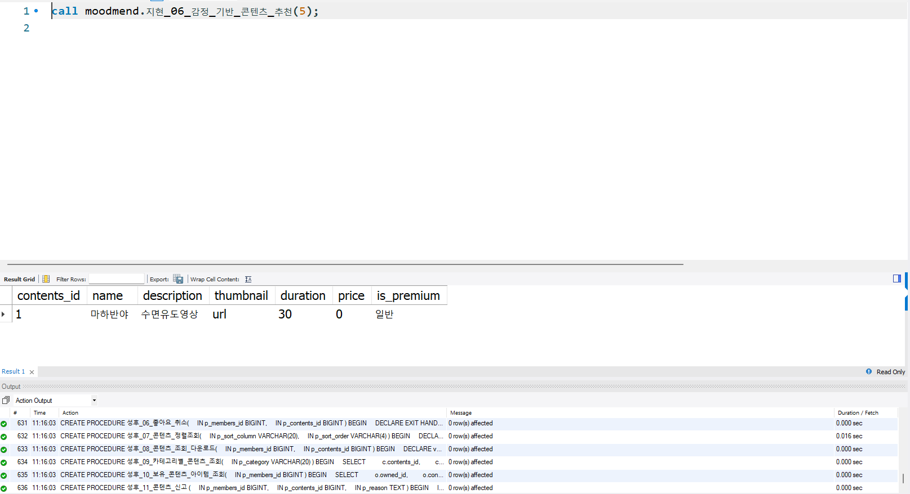
</p>

```sql
DELIMITER $$


DELIMITER ;
```

### 21. 출석기록, 출석조회 프로시저

<p align="center">
  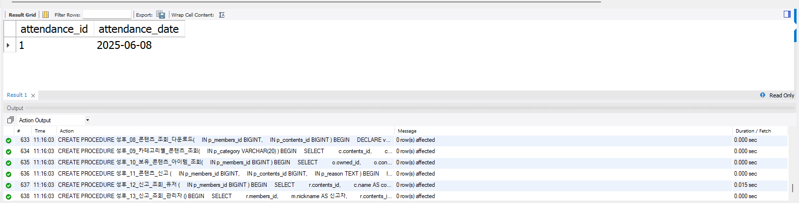
</p>

```sql
DELIMITER $$


DELIMITER ;
```

### 22. 클래스 개설 및 상태설정 클래스 조회 프로시저

<p align="center">
  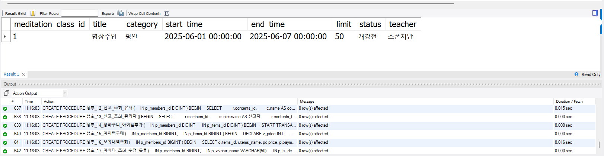
</p>

```sql
DELIMITER $$


DELIMITER ;
```

</details>

---

### 23. 클래스 신청 프로시저

<p align="center">
  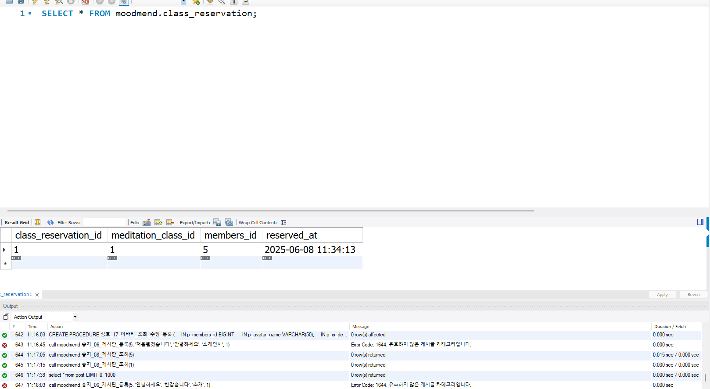
</p>

```sql
DELIMITER $$


DELIMITER ;
```

</details>

---


## 💡 기대 효과  

- 감정 기반 콘텐츠 큐레이션으로 **추천 정확도 향상**  
- 출석, 포인트, 보상, 커뮤니티 기능을 통해 **지속적인 사용자 참여 유도**  
- **명상 콘텐츠 소비 및 확산 기반 마련**

---

## 🔨 기술 스택  

<p align="left">
  
  
  
  
</p>

---

## 👥 팀원 및 역할 분장  

| 이름 | 역할 |
|------|------|
| 임성후 | `기획`, `요구사항서 작성`, `WBS 작성`, `ERD 설계`, `DDL 및 DML 작성`, `GitHub 배포`, `테스트`, `발표` |
| 조민형 | `기획`, `요구사항서 작성`, `WBS 작성`, `ERD 설계`, `DDL 및 DML 작성`, `GitHub 배포`, `테스트` |
| 김지현 | `기획`, `요구사항서 작성`, `WBS 작성`, `ERD 설계`, `DDL 및 DML 작성`, `GitHub 배포`, `테스트` |
| 이승지 | `기획`, `요구사항서 작성`, `WBS 작성`, `ERD 설계`, `DDL 및 DML 작성`, `GitHub 배포`, `테스트` |

<p align="center">
  
  
  
  
</p>

---

> “당신의 하루를 닮은 플랫폼 - Moodmend”

---

<p align="center"><strong>Moodmend · 감정 중심 명상 콘텐츠 플랫폼 DB 설계 프로젝트</strong></p>
<p align="center"><em>본 문서는 Team Moodmend가 성실히 설계하고 제출한 결과물입니다.</em></p>
<p align="center"><strong>감사합니다.</strong></p>
